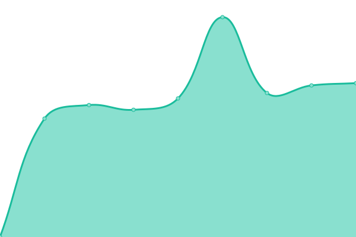

# [📈 Live Status](https://TheHardDiamond.github.io/learning_server_check): <!--live status--> **🟩 All systems operational**

This repository contains the open-source uptime monitor and status page for [TheHardDiamond](https://TheHardDiamond.github.io/learning_server_check), powered by [Upptime](https://github.com/upptime/upptime).

With [Upptime](https://upptime.js.org), you can get your own unlimited and free uptime monitor and status page, powered entirely by a GitHub repository. We use [Issues](https://github.com/TheHardDiamond/learning_server_check/issues) as incident reports, [Actions](https://github.com/TheHardDiamond/learning_server_check/actions) as uptime monitors, and [Pages](https://TheHardDiamond.github.io/learning_server_check) for the status page.

<!--start: status pages-->
<!-- This summary is generated by Upptime (https://github.com/upptime/upptime) -->
<!-- Do not edit this manually, your changes will be overwritten -->
<!-- prettier-ignore -->
| URL | Status | History | Response Time | Uptime |
| --- | ------ | ------- | ------------- | ------ |
|  [CSU-MC skin](https://csu-mc.magicalsheep.cn) | 🟩 Up | [csu-mc-skin.yml](https://github.com/TheHardDiamond/learning_server_check/commits/HEAD/history/csu-mc-skin.yml) | 

 2190ms
     
 | 

<a href="https://TheHardDiamond.github.io/learning_server_check/history/csu-mc-skin">89.01%</a>
    

|  [CSU-MC yggdrasil](https://csu-mc.magicalsheep.cn/api/yggdrasil) | 🟩 Up | [csu-mc-yggdrasil.yml](https://github.com/TheHardDiamond/learning_server_check/commits/HEAD/history/csu-mc-yggdrasil.yml) | 

 1170ms
     
 | 

<a href="https://TheHardDiamond.github.io/learning_server_check/history/csu-mc-yggdrasil">78.25%</a>
    

|  [CSU-MC Server Map](https://map.magicalsheep.cn) | 🟩 Up | [csu-mc-server-map.yml](https://github.com/TheHardDiamond/learning_server_check/commits/HEAD/history/csu-mc-server-map.yml) | 

 1276ms
     
 | 

<a href="https://TheHardDiamond.github.io/learning_server_check/history/csu-mc-server-map">99.01%</a>
    

|  [CSU-MC Server Home Page](https://www.csu-mc.magicalsheep.cn/) | 🟩 Up | [csu-mc-server-home-page.yml](https://github.com/TheHardDiamond/learning_server_check/commits/HEAD/history/csu-mc-server-home-page.yml) | 

 2114ms
     
 | 

<a href="https://TheHardDiamond.github.io/learning_server_check/history/csu-mc-server-home-page">100.00%</a>
    

<!--end: status pages-->

[**Visit our status website →**](https://TheHardDiamond.github.io/learning_server_check)

## 📄 License

- Powered by: [Upptime](https://github.com/upptime/upptime)
- Code: [MIT](./LICENSE) © [Anand Chowdhary](https://anandchowdhary.com), supported by [Pabio](https://pabio.com)
- Data in the `./history` directory: [Open Database License](https://opendatacommons.org/licenses/odbl/1-0/)
